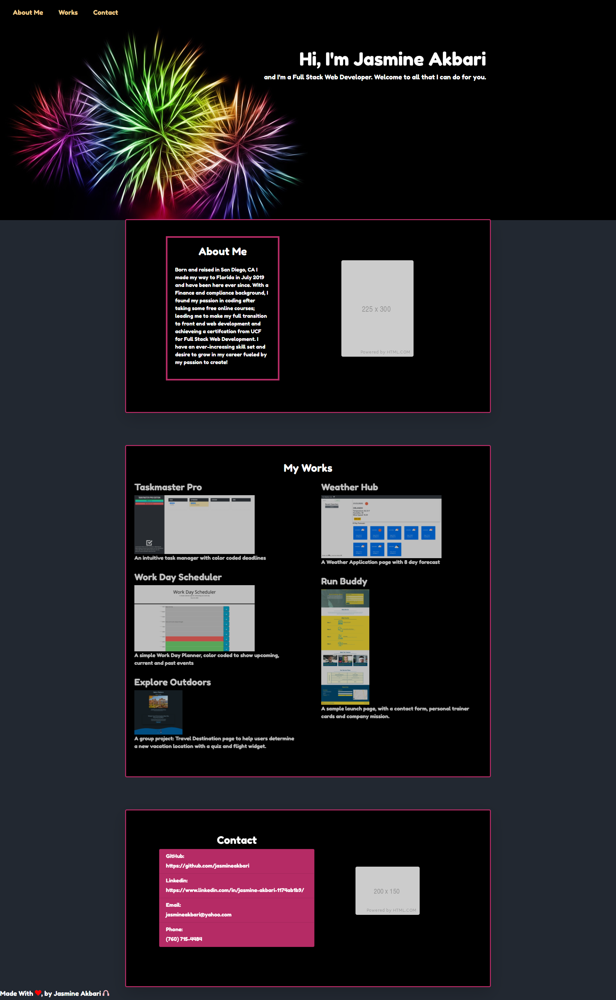

# JA-Portfolio
<h3>Purpose</h3>
This application represents what I have to offer as a front end web developer. At the top is a recent picture of me with a beautiful background I chose because of the colors and shadowing as well as how they remind of what developing an application looks like. The many layers that go into it and the styling along the way. 

I've provided some personal information to give potential employers an idea of who I am and how I work as well as why I am the best programmer for you. 

Listed also are sample projects: which are accessible by hovering and clicking on the images of the applications. 

At the very bottom of the page are all my contact and links and information.

<h3>Built With:</h3>
<ul>
<li>HTML</li>
<li>Bootstrap</li>
<li>CSS</li>
<li>AOS</li>
<li>JavaScript</li>
</ul>

<h3>Link:<h3>
Link to the application: <a href="https://jasmineakbari.github.io/JA-Portfolio/">https://jasmineakbari.github.io/JA-Portfolio/</a>

<h3>Application Screenshot:<h3>

